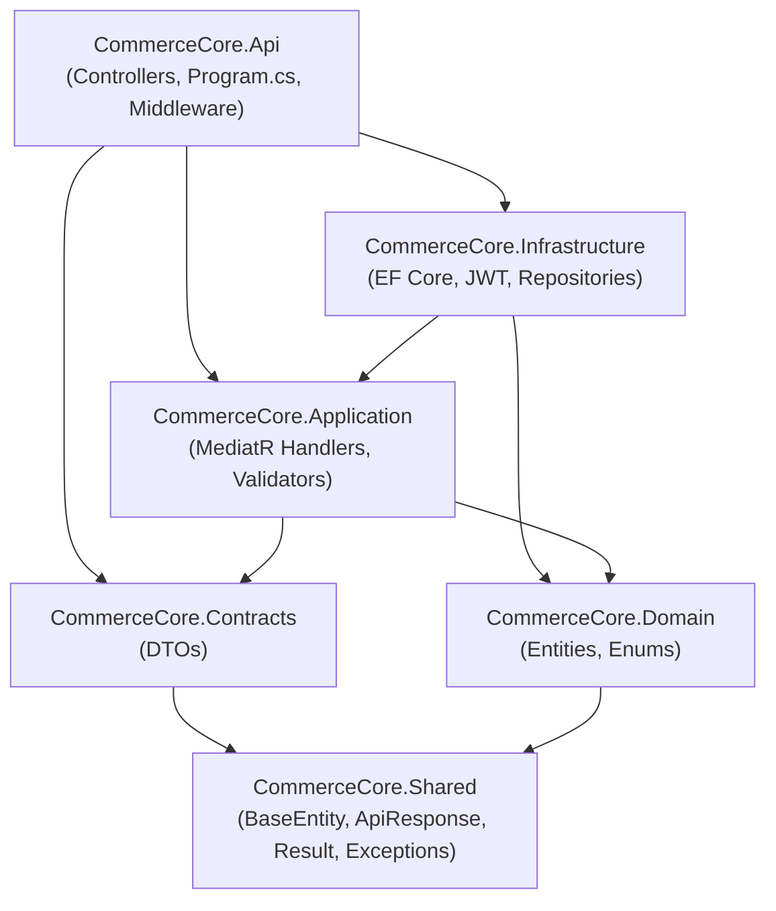

# Architecture

CommerceCore follows Clean Architecture with a CQRS Application layer. Dependencies
only ever point inward; nothing in an inner layer knows an outer layer exists.

## Layer responsibilities

**CommerceCore.Shared** — the only project every other project can depend on.
`BaseEntity` (UUID PK, full audit trail, soft delete, app-managed concurrency
`Version`), the `ApiResponse`/`PagedResult` envelopes every endpoint returns, the
`AppException` hierarchy, and a `Result`/`Result<T>` monad. Zero framework
dependencies — this compiles standalone.

**CommerceCore.Domain** — 56 entities across 10 modules (Identity, Stores, Catalog,
Inventory, Customers, Orders, Payments, Marketing, Reviews, CMS, Reference, Media,
Notifications, System/Audit). Plain POCOs — no EF Core attributes, no ASP.NET Core
references. Two naming notes: `AttributeDefinition` (not `Attribute`, which collides
with `System.Attribute`) and `InventoryItem` (not `Inventory`, avoiding a class
sharing its name with its namespace) — both still map to the exact table names
`Attributes` and `Inventory` via Fluent API.

**CommerceCore.Contracts** — request/response DTOs, but only for the hand-written
modules (Auth, Catalog, Cart, Orders). The ~27 generic CRUD modules deliberately skip
a DTO layer — see "The generic CRUD pipeline" below.

**CommerceCore.Application** — MediatR command/query handlers, FluentValidation
validators (run automatically via a pipeline behavior before any handler executes),
and two pipelines:
1. **Hand-written CQRS** for Auth, Catalog (Products/Categories), Cart, and Orders —
   real business logic: password hashing, JWT issuance/rotation, stock reservation on
   checkout, coupon discount calculation, order status transitions.
2. **The generic CRUD pipeline** (`Common/Generic/GenericCrud.cs`) — a single,
   type-safe MediatR request/handler set (`Create`, `GetById`, `GetPaged`, `Update`,
   `Delete`) parameterized by any `BaseEntity`-derived type. This is what gives the
   ~27 reference/CMS/marketing tables (Brand, Coupon, Blog, Country, Tax, ...) full
   REST CRUD without a hand-written handler file each — the correct trade-off for a
   backend whose entire purpose is being reusable across verticals rather than
   hand-tuned per module.

**CommerceCore.Infrastructure** — `AppDbContext` (its `SaveChangesAsync` override
stamps audit fields, converts every delete into a soft delete, increments the
concurrency `Version`, and writes an `AuditLog` row automatically — no handler has to
remember any of this), 56 `IEntityTypeConfiguration<T>` classes (one per entity),
the `GenericRepository<T>`/`UnitOfWork` Repository Pattern implementation, JWT token
generation, BCrypt password hashing, and multi-tenant resolution (`ICurrentTenantService`,
reading the `X-Store-Id` header).

**CommerceCore.Api** — thin controllers that just call `IMediator.Send(...)`, a global
exception middleware mapping every `AppException` subtype to the correct HTTP status
and the standard `ApiResponse` envelope, an action filter wrapping every successful
response in the same envelope, Serilog request logging, Swagger with JWT + `X-Store-Id`
security definitions, and API versioning.

## Key design decisions

**Why a header for tenancy, not subdomain sniffing?** This is a headless backend —
web, mobile, and third-party frontends don't necessarily share a browser-visible
domain. Every client states its store context explicitly via `X-Store-Id`, which also
means the backend has zero DNS/subdomain configuration burden.

**Why does the generic CRUD layer return raw Domain entities instead of DTOs?**
The ~27 reference/CMS/marketing tables are simple, admin-managed records with no
computed fields, joins, or hidden internals to shape — a bespoke DTO per entity would
be a maintenance cost with no real benefit. Product/Order/Cart, which *do* need
shaping (computed availability, joined category/brand names, snapshot fields), get
hand-written DTOs precisely because the trade-off flips there.

**Why is the optimistic-concurrency `Version` column application-managed rather than
database-native?** So the same Domain model works unmodified if the database provider
ever changes (this project moved between PostgreSQL and MySQL more than once during
development) — EF Core still throws `DbUpdateConcurrencyException` on a stale write
exactly as it would with a native token.

**Why do Order/OrderItem snapshot shipping/billing address and product name/SKU/price
instead of referencing them live?** Standard commerce practice: a customer's invoice
must never silently change because a product was renamed or an address was edited
later. Live foreign keys are kept alongside, nullable, purely for reporting drill-down.

**Reserved vs. on-hand stock.** `InventoryItem.QuantityReserved` increments at
checkout (not deducted from `QuantityOnHand` yet); `QuantityOnHand` is only actually
decremented — with a `StockMovement` audit row — when an order transitions to
`Shipped`. Cancelling before shipment releases the reservation. This is what prevents
overselling during concurrent checkouts while still letting a cancellation cleanly
restore availability.
