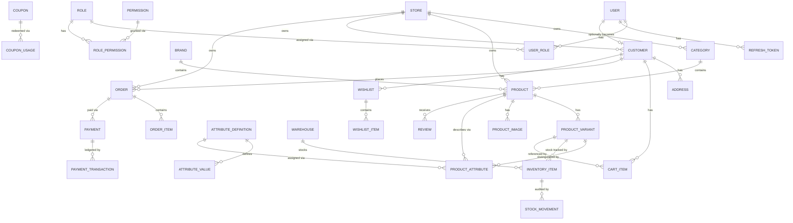

# Entity Relationships

Full column-level detail lives in `database/*.sql`. This is the core commerce flow —
the relationships that matter most for understanding how a checkout actually works.

## Full table list by module

| Module | Tables |
|---|---|
| Identity | Users, Roles, Permissions, RolePermissions, UserRoles, RefreshTokens |
| Stores | Stores, StoreSettings, StoreThemes |
| Catalog | Categories, Brands, Collections, CollectionProducts, Products, ProductVariants, ProductImages, Attributes, AttributeValues, ProductAttributes |
| Inventory | Warehouses, Inventory, StockMovements |
| Customers/Orders | Customers, Addresses, CartItems, Orders, OrderItems |
| Payments/Marketing | Payments, PaymentTransactions, Coupons, CouponUsage, Wishlists, WishlistItems, Reviews |
| CMS | Blogs, BlogCategories, Pages, Menus, MenuItems, Banners, Faqs |
| Reference | Countries, States, Cities, Currencies, Languages, Taxes, ShippingZones, ShippingMethods |
| Media/Notifications | Media, NotificationTemplates, Notifications |
| System/Audit | SystemSettings, EmailTemplates, AuditLogs, ActivityLogs |

**56 tables total.**

## The dynamic attribute engine, concretely

The same three tables — `Attributes`, `AttributeValues`, `ProductAttributes` — serve
every vertical without a schema change:

| Vertical | Example `Attributes` rows | Variant dimension? |
|---|---|---|
| Perfume | Volume, Fragrance Notes | Volume: yes · Notes: no (descriptive) |
| Bedsheets | Material, Thread Count, Size, Color | Size/Color: yes · Material/Thread Count: no |
| Electronics | RAM, Storage, Processor | RAM/Storage: yes · Processor: no |
| Jewelry | Metal Type, Gemstone, Ring Size | Ring Size: yes · Metal/Gemstone: no |

A store admin creates `AttributeDefinition` rows for their vertical (via
`/api/v1/attributes`), predefined choices as `AttributeValue` rows (e.g. "50ml",
"Red"), then assigns them to a `Product` (descriptive) or `ProductVariant` (a
purchasing dimension) via `ProductAttribute` rows. No code changes, ever.
